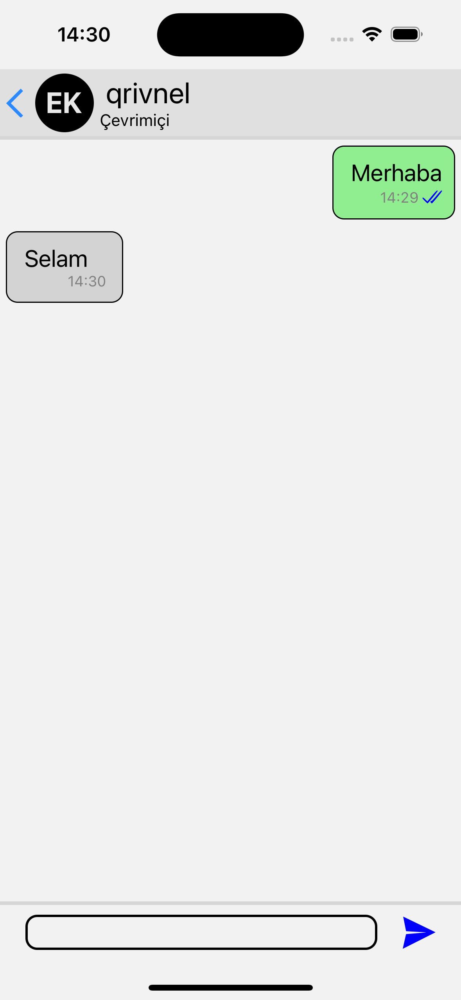
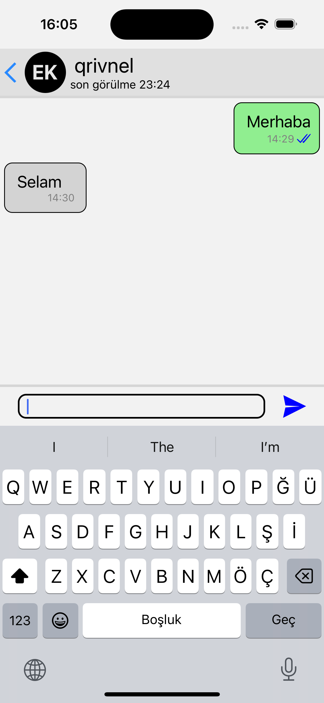
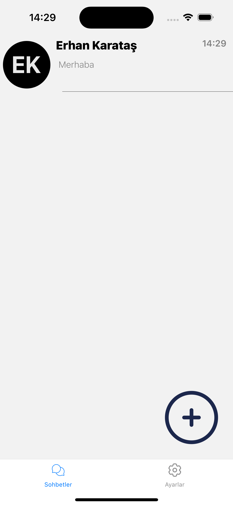
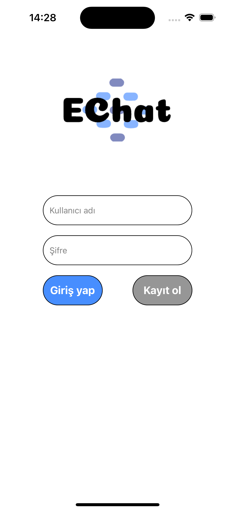
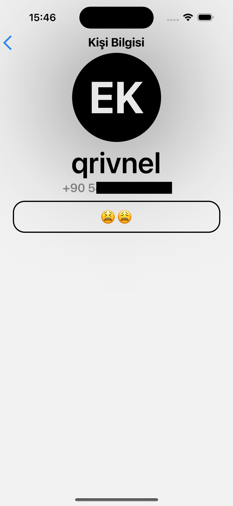
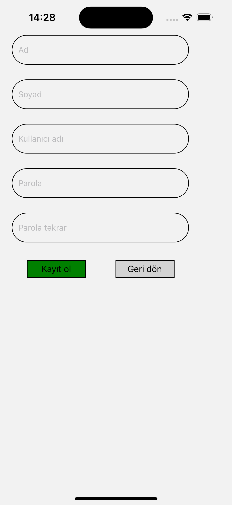

<h1 align="center">EChat - A Simple Messaging App<h1>

**EChat** is a simple messaging application that allows users to send messages in a chat interface. One of its unique features is the ability to change the color of chat bubbles, making the user experience more customizable and visually appealing.

## Features
- **Real-time Messaging**: Send and receive messages instantly.
- **Customizable Chat Bubbles**: Users can change the color of the chat bubbles for a personalized chat experience.
- **Simple and User-friendly Interface**: The app has an intuitive and clean design for easy use.

## Screenshots

Here are some screenshots of the EChat app:

1. **Chat Screen**:
   

2. **Chat Screen 2**:
   

3. **Chats Screen**:
   

4. **Login Screen**:
   

5. **Profile Screen**:
   

6. **Sign Up Screen**:
   

## Technologies Used
- **Frontend**: React (or React Native if you're targeting mobile apps)
- **Backend**: Node.js (Optional, for real-time messaging with WebSocket or Firebase)
- **WebSocket/Firebase**: For real-time communication between users (if applicable).
- **CSS/Styled Components**: For customizing the appearance of chat bubbles and the chat interface.
- **Redux**: For managing the state of the application (if needed).

## Setup and Usage

### 1. Clone the Repository:
```bash
git clone https://github.com/username/EChat.git